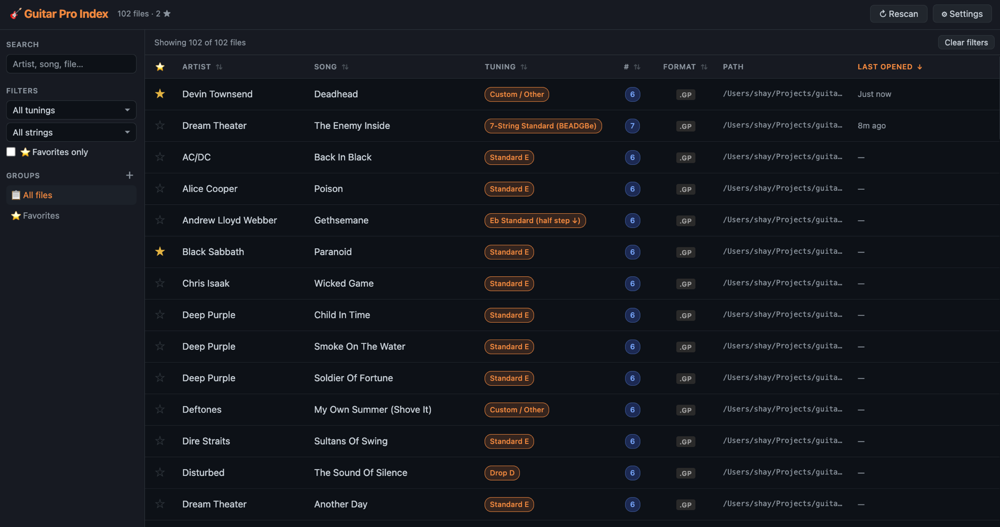

# Guitar Pro Index

A local web app that indexes your Guitar Pro files, reads artist / title / tuning directly from file metadata, and lets you search, filter, sort, and open them — backed by SQLite.



---

## Quick Start

**Requirements:** Node.js 18+, Python 3 (for `.gp` / `.gp7` metadata parsing)

```bash
# 1. Install dependencies
npm install

# 2. Start the server
node server.js
```

The app opens automatically at `http://localhost:3847`.  
Click **⚙ Settings**, add a folder, then **Save & Scan**.

---

## Features

- **Metadata from file contents** — artist, song title, and tuning are read from the Guitar Pro binary or XML, not guessed from the filename
- **Tuning detection** — identifies standard, drop, and multi-string tunings (6-, 7-, and 8-string) from MIDI pitch data
- **Search** — filters by artist, song, or filename as you type
- **Filter sidebar** — filter by tuning, string count, favorites, or group
- **Sorting** — click any column header; sort by artist, song, tuning, strings, format, or last opened
- **Last Opened** — recorded in the database each time you open a file; sortable (most recent first)
- **Favorites** — star any file; filter to favorites only
- **Groups** — create custom groups and assign files to multiple groups
- **Edit metadata** — override any field (artist, song, tuning, strings, notes, groups) via the edit modal
- **Persistent storage** — all metadata, directories, and groups are stored in a local SQLite database (`gpi.db`); survives server restarts
- **Open in Guitar Pro** — click any row or the ▶ button to open the file in your default Guitar Pro application

### Supported formats

| Extension | Version |
|-----------|---------|
| `.gp`     | Guitar Pro 7 / 8 |
| `.gp7`    | Guitar Pro 7 |
| `.gpx`    | Guitar Pro 6 |
| `.gp5`    | Guitar Pro 5 |
| `.gp4`    | Guitar Pro 4 |
| `.gp3`    | Guitar Pro 3 |
| `.gp6`    | Guitar Pro 6 (alt extension) |

---

## Platform support

| OS      | Status |
|---------|--------|
| macOS   | ✅ |
| Windows | ✅ (requires Python 3 in PATH) |
| Linux   | ✅ (requires `xdg-open` and Python 3) |

---

## Data

- **`gpi.db`** — SQLite database; all user data lives here (back it up to preserve metadata)
- **localStorage** — caches the last scan result and UI state (filters, sort); auto-migrates to the server DB on first run if you used an older version of the app
# gp_index
